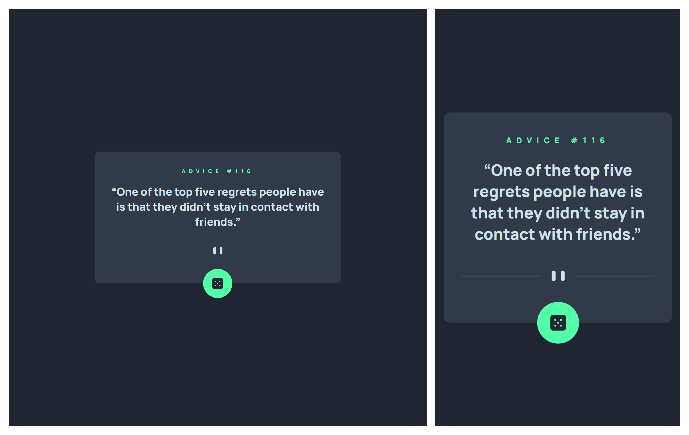

# Frontend Mentor - Advice generator app solution

This is a solution to the [Advice generator app challenge on Frontend Mentor](https://www.frontendmentor.io/challenges/advice-generator-app-QdUG-13db).

## Table of contents

- [Overview](#overview)
  - [The challenge](#the-challenge)
  - [Screenshot](#screenshot)
  - [Links](#links)
- [My process](#my-process)
  - [Built with](#built-with)
  - [What I learned](#what-i-learned)
- [Author](#author)

## Overview

### The challenge

Users should be able to:

- View the optimal layout for the app depending on their device's screen size
- See hover states for all interactive elements on the page
- Generate a new piece of advice by clicking the dice icon

### Screenshot



### Links

- Live Site URL: [Live site URL](venerable-sfogliatella-9d57c4.netlify.app/Advice)

## My process

### Built with

- Semantic HTML5 markup
- CSS custom properties
- Flexbox
- [React](https://reactjs.org/) - JS library

### What I learned

I have learned several things. By making mistakes😅.

1. We cannot use ```box-shadow``` property along with ```clip-path``` property. 
2. We cannot use ```useEffect``` hook inside Event handlers.

```ts
function handleClick() {
    setStatus("loading");
    setId(null);
    setAdvice(null);
    axios
      .get<Advice>("https://api.adviceslip.com/advice", {
        signal: AbortSignal.timeout(10000),
      })
      .then((res) => {
        setId(res.data.slip.id);
        setAdvice(res.data.slip.advice);
        setStatus("success");
        console.log(res);
      })
      .catch((err) => {
        console.log(err.message);
        setStatus("error");
      });
  }
```

## Author

- Frontend Mentor - [@madhavan-ts](https://www.frontendmentor.io/profile/madhavan-ts)

